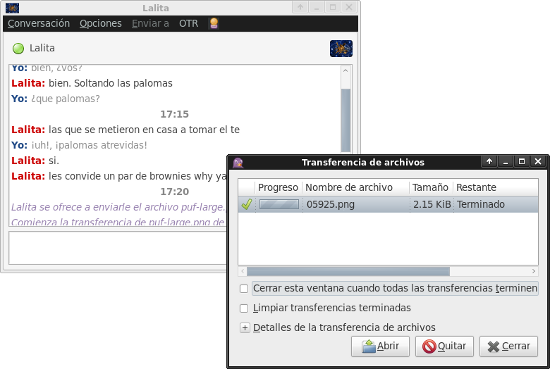

#  Ciboulette

Es una red social 100% libre, entre pares, descentralizada y distribuida

Con un simple blog y lectores de Noticias (RSS, Atom, RDF) se crea una red 
social libre en la que cada persona publica novedades directamente desde 
su computadora. Y es accesible desde cualquier computadora con 
[Tor](https://www.torproject.org/) gracias a sus servicios ocultos,

## Instalación

~~~
cd /tmp
wget https://raw.github.com/b4zz4/Ciboulette/master/ciboulette
bash ciboulette -u
~~~

Luego de instalarlo se puede usar desde la terminal `ciboulette -h` o desde su **interfaz gráfica**

* [Ayuda](doc/Ayuda.md)
* [Wiki del proyecto](http://wiki.hackcoop.com.ar/Ciboulette)
* [Como funciona Ciboulette](doc/)

## ¿Por que 100% libre?

Esta hecho únicamente con software libre. Y es una de las pocas redes sociales que respetan los [conceptos del software libre](https://www.gnu.org/philosophy/free-sw.html) en su uso

* La libertad de ejecutar el programa para cualquier propósito (libertad 0).
* La libertad de estudiar cómo funciona el programa, y cambiarlo para que haga lo que usted quiera (libertad 1). El acceso al código fuente es una condición necesaria para ello.
* La libertad de redistribuir copias para ayudar a su prójimo (libertad 2).
* La libertad de distribuir copias de sus versiones modificadas a terceros (libertad 3). Esto le permite ofrecer a toda la comunidad la oportunidad de beneficiarse de las modificaciones. El acceso al código fuente es una condición necesaria para ello.

Muchas redes sociales libres moderan a sus usuarios o pretenden un fin especifico para su red, violando nuestra **libertad 0**

## ¿Que es descentralizada?

Que no posee un centro. 
Por que no hay un servidor al que los usuarios tengan que acceder. Los pares iguales.
Gracias a Tor y la publicación de servicio ocultos dentro de la red: los datos pasan entre nodos (pares iguales), de este modo todos los nodos de Ciboulette se ven entre si.

## ¿Que es distribuida?

Es una red totalmente distribuida por no tener un centro, ni muchos de ellos.

## ¿Que es entre pares?

Que no existen servidores centrales. Los datos van de una computadora a otro directamente, pasando entre pares iguales.

## ¿Que se puede hacer con Ciboulette?

> Publicar y ver las publicaciones de nuestros amig@s

> Chatear y compartir archivos

## Quehaceres

* ~~[Acceso transparente a los servicios ocultos](https://grepular.com/Transparent_Access_to_Tor_Hidden_Services) y [DNS](http://security-world.blogspot.com.ar/2013/04/postfix-through-tor-dns.html)~~
 * Daba errores y use el [wiki de tor](https://trac.torproject.org/projects/tor/wiki/doc/TransparentProxy#TransparentlyDoingDNSandRoutingfor.onionTraffic)
 * ~~Opennic, dhcp~~
* ~~Método para descargar avatares cada tanto~~
 * Para descargar o ~~generar avatares de paginas web~~
* Metodo de update con backup en lugar de sobre escribiendo
* ~~Lanzador a novedades~~
* ~~Adaptar tema al lector y posteo~~
* ~~Lector local y estatico de feed ([rawdog](http://offog.org/code/rawdog/) + https://github.com/roop/ngoplanet_org/)~~
 * ~~mover estática dentro de nanoblogger~~
 * Publicador, editor de perfil y agregador de amigos con CGI (solo para la red local)
   * Ejemplos de como editar en [markdown](https://es.wikipedia.org/wiki/Markdown)
* ~~Sacar el nombre del usuario de `whoami`~~
 * ~~Poner datos de `finger` guardados en los archivos `.plan`, `.project` y `.pgpkey`~~
 * [xfaces](https://en.wikipedia.org/wiki/X-Face) y/o [picons](http://www.cs.indiana.edu/picons/ftp/index.html) 
 * ~~Generar QR del hostname~~
* ~~[Chat para ciboulette](chat.png) prosody + [mod_onions](https://blog.thijsalkema.de/blog/2013/06/11/xmpp-federation-over-tor-hidden-services/)~~
 * ~~Hacer instalador~~ (probarlo)
 * ~~mejorar certificado~~ https://prosody.im/doc/certificates
* [Mail sobre tor](http://www.groovy.net/ww/2012/01/torfixbis) - hice multiples pruebas pero no pude salir de mi nodo
* Método para compartir archivos y multimedia (carpeta XDG_PUBLICSHARE_DIR)
 * Documentar como hacerlo desde la terminal
 * Al usar imágenes en un articulo se copien en una carpeta y cree miniaturas
   * Generar galería de las imágenes
 * GNUtella puerto 4001 (buscar demonio)
* Leer [Feed centralizados y ocultos](https://github.com/jol333/veracity/blob/master/index.php) https://github.com/pabluk/NotifyAll
* ~~Usar una categoría estandarizada para eventos~~
 * hacer publicador (de eventos)
 * Conversor de feed2ical
* ~~aviso de que el avatar cambio~~
* hacer que las configuraciones de la instalación solo se agreguen si no existen
* ~~Falta modificar el template :P~~
* Bot de XMPP para publicar desde el chat (celulares, tablet, de modo remoto, etc)
* desinstalación por si la moscas
* Agregar Llave privada y QR en los avatares.
 * generar llave con openssl, gnutls o nacl

## Licencia

Esta obra esta liberada bajo [Licencia de Produccion de Pares](LicenciaP2P.md), [AGPLv3](https://www.gnu.org/licenses/agpl.html) y [Creative Commons BY-SA](https://creativecommons.org/licenses/by-sa/3.0/deed.es)
