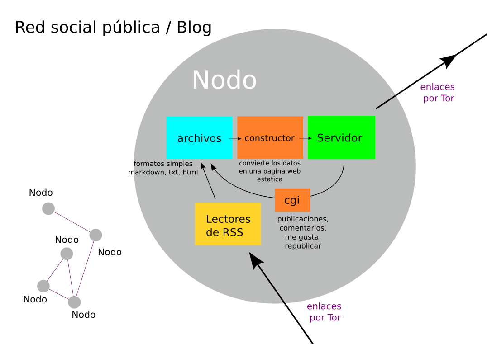
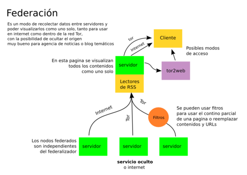
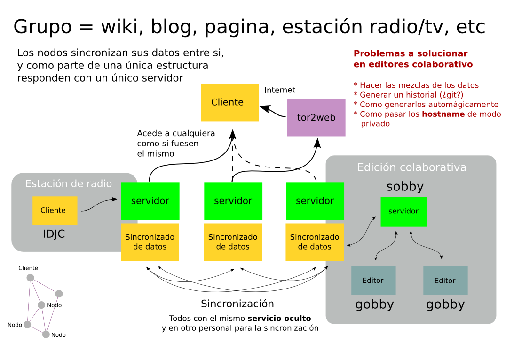

# Como funciona ciboulette

> El mail no esta solucionado todavía

> Funciona perfectamente y es el modo en el que se obtienen los datos de nuestr@s amigo@s

> Se hicieron prueba y funciona bien :D hay que crear un modo automático para ciboulette
